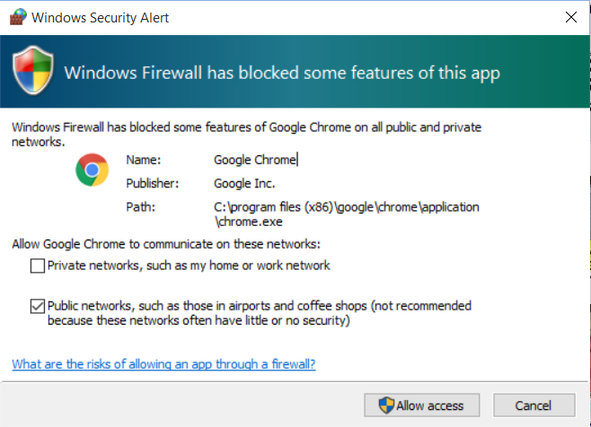

# Standalone Launcher for AdaptLearning Authoring Tool.

<b>Are you an instructional designer or courseware-developer who wants to try/work with <a href="http://www.adaptlearning.org" target="_blank">AdaptLearning Authoring Tool</a> and you find too difficult to install and run the tool? Try this Standalone Launcher!</b>

The AdaptLearning Authoring Tool Standalone Launcher is a utility that makes <b>easy to run the AdaptLearning Authoring tool</b> in you computer with few clicks.

**Easy install (Windows 7/8/10 only, soon MAC and Linux):**

<ol>
<li>Download the application: <a href="https://github.com/fabiobeoni/adapt-authoring-standalone/releases/download/v1.0-beta.1/adapt.zip" target="_blank">adapt.zip<a/> (about 490MB)</li>
<li><b>Move the "adapt.zip" file under your "C:\" drive, and unzip it</b> (about 1.5GB unziped)</li>
<li>Double click on "Start.exe"</li>
</ol>

The standalone launcher opens and displays the following window:

    

So you can manage the AdaptLearning Authoring Tool <b>just clicking on the "start"/"stop" buttons</b>, and access it by your favorite browser.

A <b>default admin user</b> is available to login. User: <b>admin@admin.com</b>   Password: <b>admin</b>

    

<u>Windows Firewall may popup the following window</u> while runnig Adapt for the first time, just <b>click on "Cancel" button</b> to proceed.

**Help and Notes**

The Adapt Authoring Tool version included with this launcher is version 0.2

Slow PCs may need some time before the browser can actually show the AdaptLearning Authoring page

Some browsers may stop opeining popups: please enable opening popup when requested by the browser to correctly display the course preview.

**License and Warranty:**

This software is released under the same licence of <a href="http://www.adaptlearning.org" target="_blank">AdaptLearning Authoring Tool</a>.

This software is free to use and given "as is" without any guarantee. Downloading and using it you confirm that you understand and accept this condition.

**Support the Project:**

Please visit and support the <a href="http://www.adaptlearning.org" target="_blank">AdaptLearning</a> project.

----------------------------
**Version number:**  1.0.0
**Adapt Authoring Tool versions:**  = 0.2
**Adapt Framework versions:**  >= 2.0
**Author:** <a href="https://it.linkedin.com/in/fabio-beoni-6a7848101" target="_blanck">Fabio Beoni</a>
