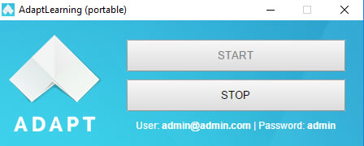
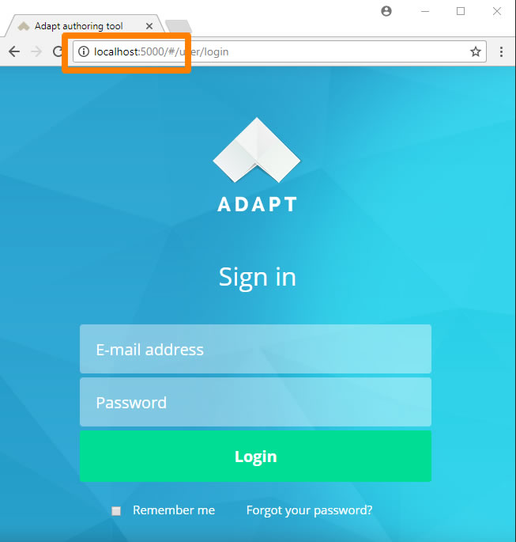

# Standalone Launcher for AdaptLearning Authoring Tool.

<b>Are you an instructional designer or courseware-developer who wants to try/work with <a href="http://www.adaptlearning.org" target="_blank">AdaptLearning Authoring Tool</a> and you find too difficult to install and run the tool? Try this Standalone Launcher!</b>

The AdaptLearning Authoring Tool Standalone Launcher is a utility that makes <b>easy to run the AdaptLearning Authoring tool</b> in you computer with few clicks.

**Easy install (Windows 7/8/10 only, soon MAC and Linux):**

<ol>
<li>Download the application: <a href="https://github.com/fabiobeoni/adapt-authoring-standalone/releases/download/1.0/adapt.zip" target="_blank">adapt.zip<a/></li>
<li>Move the "adapt.zip" file under your <b>"C:\"</b> drive, and unzip it</li>
<li>Double click on "Start.exe"</li>
</ol>

That's it!

The standalone launcher opens and displays the following window:

    

So you can manage the AdaptLearning Authoring Tool <b>just clicking on the "start"/"stop" buttons</b>, and access it by your favorite browser.

A <b>default admin user</b> is available to login. User: <b>admin@admin.com</b>   Password: <b>admin</b>

    

**License and Guarantee Note:**

This software is released under the same licence of <a href="http://www.adaptlearning.org" target="_blank">AdaptLearning Authoring Tool</a>.

This software is free to use and given "as is" without any guarantee. Downloading and using it you confirm that you understand and accept this condition.

**Note:**

Please visit and support the <a href="http://www.adaptlearning.org" target="_blank">AdaptLearnin</a> project.

----------------------------
**Version number:**  1.0.0
**Adapt Framework versions:**  >= 2.0
**Author:** <a href="https://it.linkedin.com/in/fabio-beoni-6a7848101" target="_blanck">Fabio Beoni</a>
